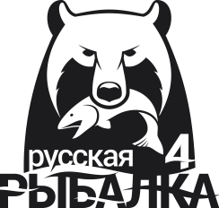

# Русская рыбалка 4



Приветствую тебя пользователь! В данном проекте ты увидишь  
своеобразную копию многостраничного сайта _Руссой рыбалки 4_.  
Так же можно увидеть красивые виды локаций на главной странице сайта,  
во вкладке _Медиа_ есть различные картинки.

## Отличия от оригинального проекта:  
- есть картинки водоемов с информацией, какая рыба там находится;  
- свой дизайн сайта.

Не будем затягивать и сразу перейдем к проекту.

## Для запуска проекта:

В _Командной строке_ или _Windows PowerShell_ следующую команду:  

```bash
git clone git@github.com:Pushkin-hub/rf4-clone-frontend.git
```  

Далее, в _Командной строке_ или _Windows PowerShell_ войдите в проект  
и напишите следующую команду:

```bash
npm install --force

    или

npm i --force
```

В каталоге проекта вы можете запустить:

```bash
npm start
```  

Запускает приложение в режиме разработки. Чтобы просмотреть его в браузере,  
откройте http://localhost:3000 .  

Чтобы запустить _backend_, напишите следующую команду:

```bash
cd backend/public
php -S localhost:8000
```  

Чтобы зайти в _Adminer_, скачайте _Docker Desktop_ и в кансоле напишите следующую команду:

```bash
docker compose up
```  

Запускает приложение в режиме разработки. Чтобы просмотреть его в браузере,  
откройте http://localhost:8080 .  
В файле compose.yaml вы найдете логин, пароль и базу данных для входа в _Adminer_.